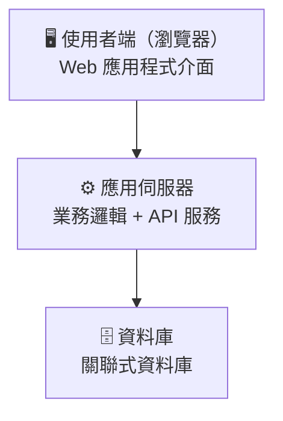
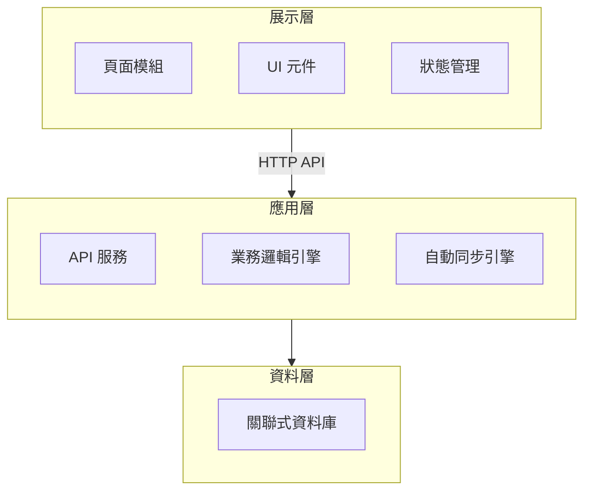
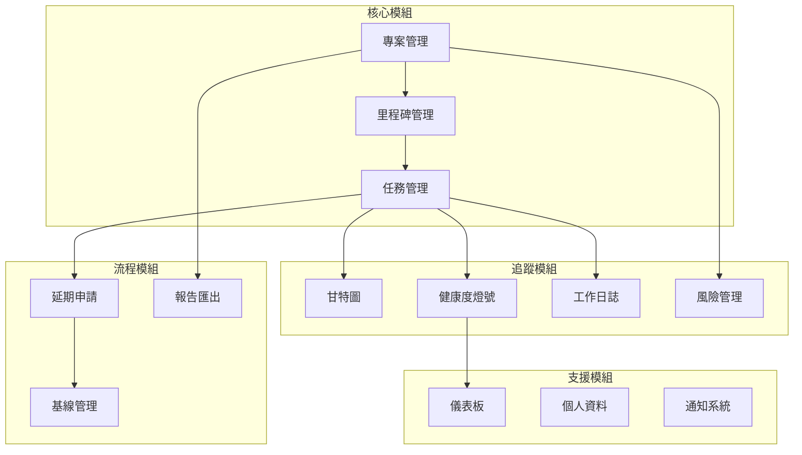
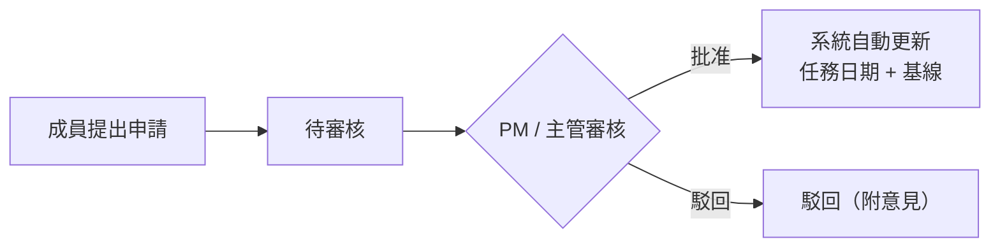
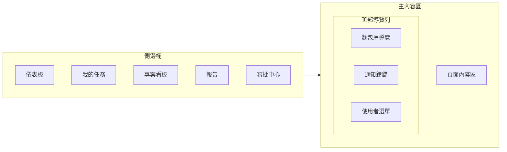
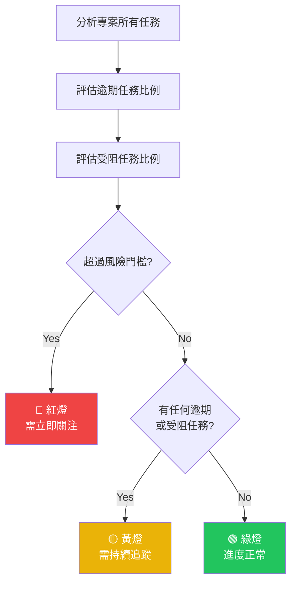
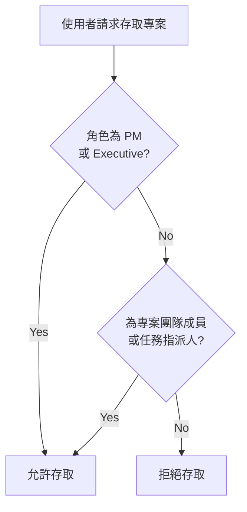

# 專案看板系統 系統設計概要 (SDD) — 客戶版

**文件版本**：v1.0（客戶版）
**建立時間**：2026/2/13
**對應 PRD 版本**：v2.0（客戶版）

---

## 目錄

1. [系統概述](#1-系統概述)
2. [系統架構](#2-系統架構)
3. [功能模組](#3-功能模組)
4. [使用者介面](#4-使用者介面)
5. [核心業務邏輯](#5-核心業務邏輯)
6. [安全與權限](#6-安全與權限)
7. [部署與維運](#7-部署與維運)

---

## 1. 系統概述

### 1.1 系統目的

本系統為企業團隊內部專案管理平台，提供專案建立、任務追蹤、甘特圖視覺化、工作日誌記錄、延期申請審核、自動健康度計算等功能，取代傳統 Excel + Email 的管理模式。

### 1.2 設計原則

- **自動化優先**：里程碑狀態、任務進度、專案健康度皆由系統自動計算，減少人為操作負擔。
- **角色導向可見性**：權限以角色為基礎控制可見性（PM/Member/Executive），確保資訊安全與適當揭露。
- **操作直覺化**：以時間軸表格、甘特圖、拖放排序等視覺化工具，降低學習門檻。
- **資料一致性**：系統透過自動同步機制，確保專案各層面資料（任務進度、里程碑狀態、健康度燈號）保持一致。

### 1.3 系統邊界

系統為獨立的 Web 應用程式，目前不依賴任何外部第三方服務。

---

## 2. 系統架構

### 2.1 整體架構

系統採用現代化的三層式架構設計：

### 2.2 分層職責

| 層級 | 職責 |
|------|------|
| **展示層** | UI 渲染、使用者互動、表單驗證、狀態管理 |
| **應用層** | HTTP API 端點、業務邏輯處理、自動同步計算 |
| **資料層** | 資料持久化、索引、關聯約束 |

---

## 3. 功能模組

### 3.1 模組總覽

### 3.2 專案管理模組

- 完整的專案生命週期管理（建立、編輯、刪除）。
- 支援 SMART 目標欄位引導填寫。
- 專案代碼自動生成（依專案類型 + 年份 + 流水號）。
- 草稿自動儲存機制。
- 依專案類型自動套用里程碑範本。

### 3.3 任務管理模組

- 時間軸表格介面，支援 inline 編輯與拖放排序。
- 任務狀態管理：待開始 → 進行中 → 已完成 / 受阻。
- 自動建立任務順序相依關係。
- 批次儲存機制，支援差異計算與多步驟更新。

### 3.4 甘特圖模組

- 自建甘特圖元件，視覺化任務時程。
- 支援 5 種時間尺度（日 / 週 / 月 / 季 / 年）。
- 相依關係箭頭顯示。
- 基線比較顯示（原始計畫 vs 實際進度）。
- 拖拉調整任務時間。

### 3.5 健康度引擎

系統根據任務狀態自動計算專案健康度燈號（紅 / 黃 / 綠），並在儀表板、專案列表、專案詳情頁等處即時顯示。

### 3.6 工作日誌模組

- 任務層級的日誌記錄，包含工作內容、日期、工時。
- 日誌草稿自動儲存。
- 自動彙整更新紀錄，按成員/日期分組。
- 日誌活動作為「本週是否有更新」的追蹤依據。

### 3.7 延期申請流程

### 3.8 報告模組

- 專案統計報表（狀態分佈、工作量、進度）。
- PDF 報告匯出。
- AI 報告自動產生（規劃中）。

---

## 4. 使用者介面

### 4.1 頁面結構

| 頁面 | 功能 | 可存取角色 |
|------|------|-----------|
| 登入 | 使用者身分驗證 | 所有人 |
| 儀表板 | KPI 統計、風險、里程碑概覽 | PM, Executive |
| 專案列表 | 搜尋、篩選、建立專案 | 所有人 |
| 專案詳情 | 甘特圖、相依分析、更新紀錄 | 所有人 |
| 我的任務 | 任務清單、工作日誌、延期申請 | PM, Member |
| 報告 | 統計報表、PDF 匯出 | PM, Executive |
| 延期審核 | 審核延期申請 | PM, Executive |
| 個人資料 | 個人資訊、統計 | 所有人 |

### 4.2 主佈局

- 側邊欄可收合，導覽項目依角色動態顯示。
- Badge 即時顯示待審核數量與風險任務數。

### 4.3 核心元件

#### 時間軸表格
主要任務管理介面，嵌入專案編輯對話框。支援拖放排序、inline 編輯，以類似試算表的操作體驗管理里程碑與任務。

#### 甘特圖
自建甘特圖元件，支援多種時間尺度檢視、相依關係箭頭、基線比較。

#### 專案編輯對話框
包含 5 個分頁的完整專案編輯介面：

| 分頁 | 內容 |
|------|------|
| 基本資訊 | 名稱、類型、層別、需求來源、目標、SMART 目標 |
| 專案說明 | 目的、範圍、ROI、開案原因、預期效益 |
| 團隊成員 | 團隊管理、成員搜尋 |
| 風險管理 | 風險列表、新增/編輯/關閉 |
| 工作項目 | 時間軸表格（里程碑 + 任務） |

---

## 5. 核心業務邏輯

### 5.1 專案健康度計算

系統根據任務的逾期狀況與受阻狀況，自動計算專案的健康度燈號：

### 5.2 自動同步機制

系統透過以下自動同步機制確保資料一致性：

- **里程碑狀態同步**：根據該里程碑下所有任務的完成狀況，自動更新里程碑的狀態與進度。
- **任務進度同步**：根據工作日誌記錄，自動計算並更新任務進度百分比。
- **任務自動推進**：自動將已過開始日期的待開始任務推進為進行中狀態。

### 5.3 任務相依圖與關鍵路徑

系統建構任務相依關係圖，並計算關鍵路徑，協助 PM 識別影響專案時程的關鍵任務鏈。

- 識別直接受阻的後續任務。
- 計算間接受影響的任務與里程碑。
- 評估延遲鏈的總長度。

### 5.4 自動風險偵測

系統自動偵測以下風險類型：

| 風險類型 | 說明 |
|---------|------|
| 逾期任務 | 已超過截止日期但尚未完成的任務 |
| 受阻鏈 | 因前置任務未完成而無法推進的任務 |
| 待審延期 | 等待審核的延期申請 |
| 無近期更新 | 進行中但多日無工作日誌更新的任務 |
| 里程碑延遲 | 已超過到期日但尚未完成的里程碑 |
| 待解決協助 | 已核准延期但協助需求尚未處理 |

### 5.5 里程碑範本系統

每種專案類型對應預設里程碑範本，加速專案建立：

| 專案類型 | 里程碑階段範例 |
|---------|-------------|
| NPI（新產品導入） | 需求分析 → 設計 → 試作 → 驗證 → 試產 → 量產 |
| 成本優化 | 成本分析 → 方案設計 → 實施 → 驗證 → 持續追蹤 |
| 品質改善 | 問題分析 → 改善方案 → 實施 → 驗證 → 標準化 |
| 自動化 | 流程分析 → 系統設計 → 開發 → 測試 → 上線教育 |
| 產品策略 | 市場調查 → 策略規劃 → 執行 → 檢討 → 評估 |
| 流程優化 | 分析 → 設計 → 實施 → 驗證 → 標準化 |
| 外部需求 | 需求確認 → 影響評估 → 實施 → 驗證 → 移交 |

---

## 6. 安全與權限

### 6.1 權限模型

系統採用角色權限控制（RBAC），依角色控制功能與資料的可見性：

| 功能類別 | PM | Executive | Member |
|---------|:---:|:---------:|:------:|
| 專案建立/編輯/刪除 | ✓ | — | — |
| 查看所有專案 | ✓ | ✓ | 僅參與的 |
| 預算管理 | ✓ | 僅查看 | — |
| 團隊管理 | ✓ | — | — |
| 報告匯出 | ✓ | ✓ | — |
| 風險管理 | ✓ | 僅高影響度 | — |
| 延期審核 | ✓ | ✓ | — |
| 甘特圖查看 | ✓ | ✓ | ✓ |

### 6.2 資料存取控制

### 6.3 安全措施

- 所有傳輸使用 HTTPS 加密。
- 使用者密碼安全加密儲存。
- API 層面的身分驗證與權限檢查。
- 關鍵操作二次確認機制。

---

## 7. 部署與維運

### 7.1 部署架構

系統採用容器化部署，包含以下服務：

| 服務 | 說明 |
|------|------|
| 應用伺服器 | Web 應用程式服務 |
| 資料庫 | 關聯式資料庫服務 |

### 7.2 系統需求

| 項目 | 需求 |
|------|------|
| 瀏覽器 | Chrome、Firefox、Safari、Edge 最新版 |
| 網路 | 穩定的企業內部網路或外網連線 |
| 螢幕 | 建議 1280×720 以上解析度 |

### 7.3 維運機制

- 定期自動備份資料庫。
- 系統可用性目標 99.5%。
- 支援水平擴展以應對使用者增長。

---

**文件版本**：v1.0（客戶版）
**建立時間**：2026/2/13
**對應 PRD 版本**：v2.0（客戶版）
